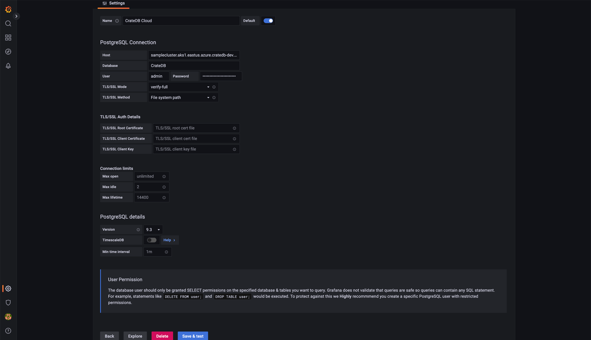
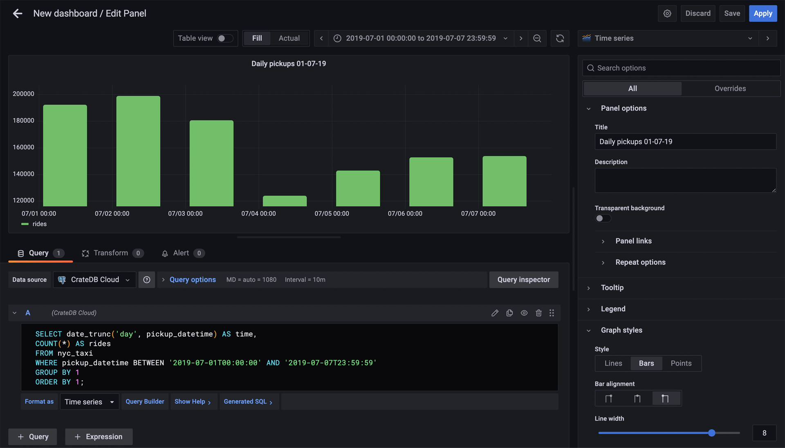
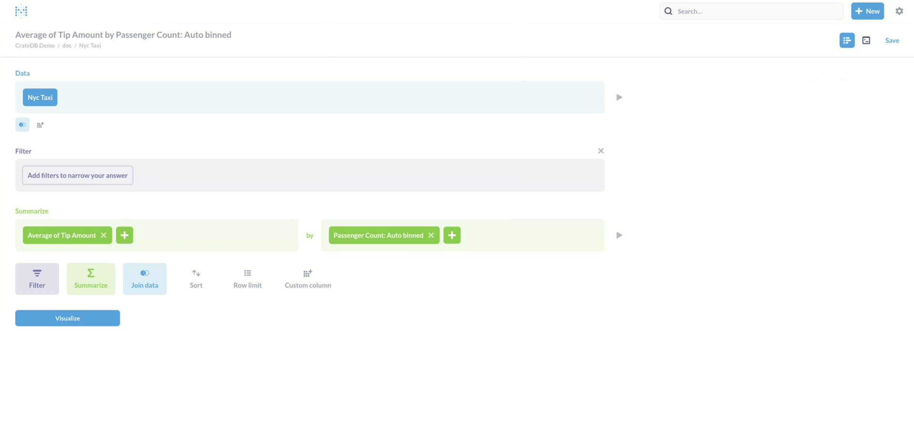
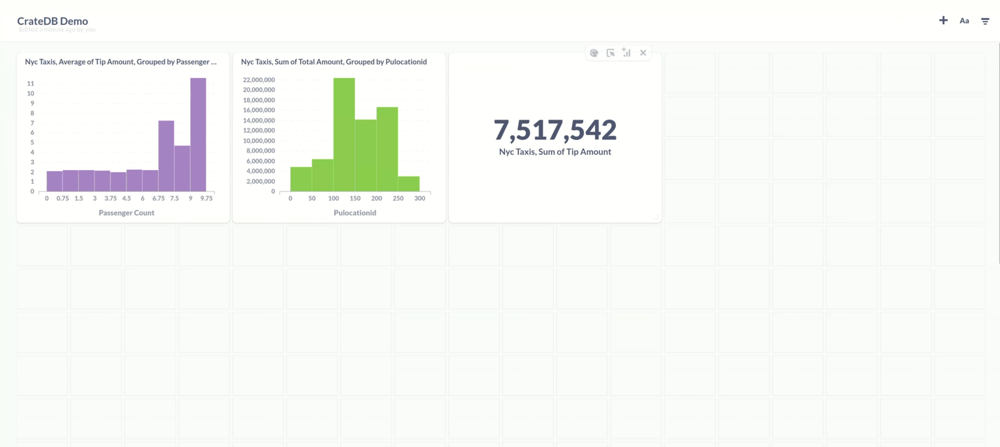

(visualize)=
# Visualize data in CrateDB

Use dashboard and other data visualization applications and toolkits for
visualizing data stored inside CrateDB.


(apache-superset)=
(preset)=
(superset)=
## Apache Superset / Preset

```{div}
:style: "float: right"
[{w=180px}](https://superset.apache.org/)

[{w=180px}](https://preset.io/)
```

[Apache Superset] is an open-source modern data exploration and visualization
platform, written in Python.

[Preset] offers a managed, elevated, and enterprise-grade SaaS for open-source
Apache Superset.

**Product:**
- [Introduction to time series visualization in CrateDB and Apache Superset (Blog)]
- [Use CrateDB and Apache Superset for Open Source Data Warehousing and Visualization (Blog)]
- [Introduction to time series visualization in CrateDB and Apache Superset (Webinar)]
- [Introduction to Time-Series Visualization in CrateDB and Apache Superset (Preset.io)]

**Development:**
- [Set up Apache Superset with CrateDB]
- [Set up an Apache Superset development sandbox with CrateDB]
- [Verify Apache Superset with CrateDB]

{h=200px}
{h=200px}

```{seealso}
[CrateDB and Superset]
```

:::{dropdown} **Managed Superset**
```{div}
:style: "float: right"
[{w=180px}](https://preset.io/)
```

[Preset Cloud] is a fully-managed, open-source BI for the modern data stack,
based on Apache Superset.

- **Hassle-free setup:** There is no need to install or maintain software with Preset.
  Get the latest version of Superset in a secure, reliable, and scalable SaaS experience.
- **Up-to-date Superset, always:** Access all the latest features of Superset
  released and thoroughly tested every two weeks.
- **One-click to deploy multiple workspaces:** Give each team in your organization
  a separate Superset workspace to protect sensitive data.
- **Control user roles and access:** Easily assign roles and fine-tune data access
  using RBAC and row-level security (RLS).

```{div}
:style: "clear: both"
```
:::


## Cluvio

```{div}
:style: "float: right"
[{w=180px}](https://www.cluvio.com/)
```

[Cluvio] is a programmable and interactive dashboarding platform — your analytics
cockpit. Run queries, filter your results, choose the most vivid way to display them,
and share them with your colleagues and partners without efforts.

Cluvio dashboards are interactive, so you can easily change aggregation, select a
specific timerange or filter dashboards by any individual attribute of your data.

Use SQL and R to analyze your data and create beautiful, interactive dashboards for
your entire company in few minutes.

- [Data Analysis with Cluvio and CrateDB]

{h=200px}
{h=200px}


## Dash

```{div}
:style: "float: right"
[{w=180px}](https://dash.plotly.com/)
```

[Dash] is a low-code framework for rapidly building data apps in Python,
based on [Plotly]. Built on top of Plotly.js, React and Flask, Dash ties
modern UI elements like dropdowns, sliders, and graphs, directly to your
analytical Python code.

Dash is a trusted Python framework for building ML & data science web apps. Many
specialized open-source Dash libraries exist that are tailored for building
domain-specific Dash components and applications.

```{div}
:style: "clear: both"
```
:::

{h=200px}
{h=200px}

**See also**
- The `timeseries-queries-and-visualization.ipynb` notebook explores how to access
  timeseries data from CrateDB via SQL, load it into pandas DataFrames, and visualize
  it using Plotly.

  It includes advanced time series operations in SQL, like aggregations, window functions,
  interpolation of missing data, common table expressions, moving averages, JOINs, and
  the handling of JSON data.

  [](https://github.com/crate/cratedb-examples/blob/main/topic/timeseries/explore/timeseries-queries-and-visualization.ipynb) [](https://colab.research.google.com/github/crate/cratedb-examples/blob/main/topic/timeseries/explore/timeseries-queries-and-visualization.ipynb)

- [Explore Dash Examples]

:::{dropdown} **Dash Enterprise**
```{div}
:style: "float: right"
[{w=180px}](https://plotly.com/dash/)
```

Dash Enterprise is Plotly’s paid product for building, testing, deploying, managing,
and scaling Dash applications organization-wide, advertised as the Premier Data App
Platform for Python.

When building Dash apps in a business setting, Dash Enterprise supports you to deploy
and scale them, plus integrate them with IT infrastructure such as authentication and
VPC services, in order to deliver faster and more impactful business outcomes on AI
and data science initiatives.

Dash Enterprise enables the rapid development of production-grade data apps within your
business. Python has taken over the world, and traditional BI dashboards no longer
cut it in today’s AI and ML driven world. Production-grade, low-code Python data apps
are needed to visualize the sophisticated data analytics and data pipelines that run
modern businesses.

```{div}
:style: "clear: both"
```
{h=200px}
{h=200px}
:::


## Explo

```{div}
:style: "float: right"
[{w=180px}](https://www.explo.co/)
```

[Explo] is a software platform for personalized and real-time customer facing
analytics. Organizations use Explo’s platform services "Explore", "Host", "Report
builder", and "Email", to activate and share data with their customers.

[Explo Explore] integrates directly into your web portal or application and provides
your customers with a complete self-service data toolkit, which can also be used to
run white-labeled data portals.

```{div}
:style: "clear: both"
```

- [Introduction to Time Series Visualization in CrateDB and Explo]

{h=200px}
{h=200px}


## Grafana

```{div}
:style: "float: right"
[{w=180px}](https://grafana.com/grafana/)
```

[Grafana OSS] is the leading open-source metrics visualization tool that helps you
build real-time dashboards, graphs, and many other sorts of data visualizations.
[Grafana Cloud] is a fully-managed service offered by [Grafana Labs].

Grafana complements CrateDB in monitoring and visualizing large volumes of machine
data in real-time.

Connecting to a CrateDB cluster will use the Grafana PostgreSQL data source adapter.
The following tutorials outline how to configure Grafana to connect to CrateDB, and
how to run a database query. 

**See also**
- [Using Grafana with CrateDB Cloud]

{h=200px}
{h=200px}

```{seealso}
[CrateDB and Grafana]
```

:::{dropdown} **Managed Grafana**
```{div}
:style: "float: right"
[{w=180px}](https://grafana.com/grafana/)
```

Get Grafana fully managed with [Grafana Cloud].

- Offered as a fully managed service, Grafana Cloud is the fastest way to adopt
  Grafana and includes a scalable, managed backend for metrics, logs, and traces.
- Managed and administered by Grafana Labs with free and paid options for
  individuals, teams, and large enterprises.
- Includes a robust free tier with access to 10k metrics, 50GB logs, 50GB traces,
  50GB profiles, and 500VUh of k6 testing for 3 users.

```{div}
:style: "clear: both"
```
:::


## hvPlot and Datashader

```{div}
:style: "float: right"
[{w=220px}](https://hvplot.holoviz.org/)

[{w=220px}](https://datashader.org/)
```

[hvPlot] is a familiar and high-level API for data exploration and visualization.
[Datashader] is a graphics pipeline system for creating meaningful representations of
large datasets quickly and flexibly.

It is used on behalf of the [hvPlot] package, which is based on [HoloViews], from the
family of [HoloViz] packages of the [PyViz] ecosystem.

With Datashader, you can "just plot" large datasets and explore them instantly, with no
parameter tweaking, magic numbers, subsampling, or approximation, up to the resolution
of the display.

[hvPlot] sources its power in the [HoloViz] ecosystem. With [HoloViews], you get the
ability to easily layout and overlay plots, with [Panel], you can get more interactive
control of your plots with widgets, with [DataShader], you can visualize and interactively
explore very large data, and with [GeoViews], you can create geographic plots.

```{div}
:style: "clear: both"
```

**See also**

- The `cloud-datashader.ipynb` notebook explores the [HoloViews] and [Datashader] frameworks
  and outlines how to use them to plot the venerable NYC Taxi dataset, after importing it
  into a CrateDB Cloud database cluster. _Please note the notebook is a work in progress._ 

  [](https://github.com/crate/cratedb-examples/blob/amo/cloud-datashader/topic/timeseries/explore/cloud-datashader.ipynb) [](https://colab.research.google.com/github/crate/cratedb-examples/blob/amo/cloud-datashader/topic/timeseries/explore/cloud-datashader.ipynb)

{h=200px}
{h=200px}


## Metabase

```{div}
:style: "float: right"
[{w=180px}](https://www.metabase.com/cloud/)
```

[Metabase] is the ultimate data analysis and visualization tool that unlocks the full
potential of your data. Build for data and made for everyone, Metabase can be leveraged
with no SQL required.

Fast analytics with the friendly UX and integrated tooling to let your company explore
data on their own.

**See also**
- [Using Metabase with CrateDB Cloud]
- [Real-time data analytics with Metabase and CrateDB]

{h=140px}
{h=140px}

```{seealso}
[CrateDB and Metabase]
```

:::{dropdown} **Managed Metabase**
```{div}
:style: "float: right"
[{w=180px}](https://www.metabase.com/)
```

With [Metabase Cloud], you will get a fast, reliable, and secure deployment
with none of the work or hidden costs that come with self-hosting.

- **Save the time** needed for setup and maintenance of the platform, focusing only on the insights we can get from our data.
- **Trustworthy, production-grade deployment** by people who do this stuff for a living.
  With the infrastructure, specialists, and thousands of Metabases in our cloud, we've put a lot of thought and resources into optimizing hosting.
- **Upgrades:** Automatically upgrade to the current version, so you're always getting the latest and greatest of Metabase.
- **Backups:** The way they should be: there when you need them, out of sight and out of mind when you don't.
- **SMTP server:** Even your alerts and dashboard subscriptions covered with a preconfigured and managed SMTP server.


```{div}
:style: "clear: both"
```
:::


## Plotly

```{div}
:style: "float: right"
[{w=180px}](https://plotly.com/)
```

[Plotly] Open Source Graphing Libraries make interactive, publication-quality graphs.
Line plots, scatter plots, area charts, bar charts, error bars, box plots, histograms,
heatmaps, subplots, multiple-axes, polar charts, bubble charts, and maps.

The supported programming languages / libraries / frameworks are Python, R, Julia,
JavaScript, ggplot2, F#, MATLAB®, and Dash.

Based on Plotly, [Dash] is a low-code framework for rapidly building data apps in Python.

```{div}
:style: "clear: both"
```

{h=200px}
{h=200px}

**See also**

- The `timeseries-queries-and-visualization.ipynb` notebook explores how to access
  timeseries data from CrateDB via SQL, load it into pandas DataFrames, and visualize
  it using Plotly.

  It includes advanced time series operations in SQL, like aggregations, window functions,
  interpolation of missing data, common table expressions, moving averages, JOINs, and
  the handling of JSON data.

  [](https://github.com/crate/cratedb-examples/blob/main/topic/timeseries/explore/timeseries-queries-and-visualization.ipynb) [](https://colab.research.google.com/github/crate/cratedb-examples/blob/main/topic/timeseries/explore/timeseries-queries-and-visualization.ipynb)

- [Explore Dash Examples]


```{toctree}
:hidden:

- Grafana <../tutorials/grafana>
- Metabase <../tutorials/metabase>
```


[Apache Superset]: https://superset.apache.org/
[Cluvio]: https://www.cluvio.com/
[CrateDB and Grafana]: https://crate.io/integrations/cratedb-and-grafana 
[CrateDB and Superset]: https://crate.io/integrations/cratedb-and-apache-superset 
[CrateDB and Metabase]: https://crate.io/integrations/cratedb-and-metabase
[Dash]: https://plotly.com/dash/
[Data Analysis with Cluvio and CrateDB]: https://community.crate.io/t/data-analysis-with-cluvio-and-cratedb/1571
[Datashader]: https://datashader.org/
[Explo]: https://www.explo.co/
[Explo Explore]: https://www.explo.co/products/explore
[Explore Dash Examples]: https://plotly.com/examples/
[GeoViews]: https://geoviews.org/
[Grafana Cloud]: https://grafana.com/grafana/
[Grafana Labs]: https://grafana.com/about/team/
[Grafana OSS]: https://grafana.com/oss/grafana/
[HoloViews]: https://www.holoviews.org/
[HoloViz]: https://holoviz.org/
[hvPlot]: https://hvplot.holoviz.org/
[Introduction to Time Series Visualization in CrateDB and Explo]: https://crate.io/blog/introduction-to-time-series-visualization-in-cratedb-and-explo
[Introduction to time series visualization in CrateDB and Apache Superset (Blog)]: https://community.crate.io/t/introduction-to-time-series-visualization-in-cratedb-and-superset/1041
[Introduction to time series visualization in CrateDB and Apache Superset (Webinar)]: https://cratedb.com/resources/webinars/lp-wb-introduction-to-time-series-visualization-in-cratedb-apache-superset
[Introduction to Time-Series Visualization in CrateDB and Apache Superset (Preset.io)]: https://preset.io/blog/timeseries-cratedb-superset/
[Metabase]: https://www.metabase.com/
[Metabase Cloud]: https://www.metabase.com/cloud/
[Panel]: https://panel.holoviz.org/
[Plotly]: https://plotly.com/graphing-libraries/
[Preset]: https://preset.io/
[Preset Cloud]: https://preset.io/product/
[PyViz]: https://pyviz.org/
[Real-time data analytics with Metabase and CrateDB]: https://www.metabase.com/community_posts/real-time-data-analytics-with-metabase-and-cratedb
[Set up Apache Superset with CrateDB]: https://community.cratedb.com/t/set-up-apache-superset-with-cratedb/1716
[Set up an Apache Superset development sandbox with CrateDB]: https://community.crate.io/t/set-up-an-apache-superset-development-sandbox-with-cratedb/1163
[Time Series with CrateDB]: https://github.com/crate/cratedb-examples/tree/main/topic/timeseries/explore
[Use CrateDB and Apache Superset for Open Source Data Warehousing and Visualization (Blog)]: https://crate.io/blog/use-cratedb-and-apache-superset-for-open-source-data-warehousing-and-visualization
[Using Grafana with CrateDB Cloud]: #integrations-grafana
[Using Metabase with CrateDB Cloud]: #integrations-metabase
[Verify Apache Superset with CrateDB]: https://github.com/crate/cratedb-examples/tree/main/framework/apache-superset
